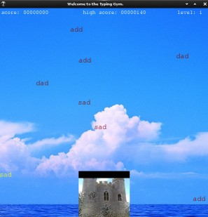

# ytt
Typing Tutor.  This helps keeping eyes on screen, and gets keystroke feedback from screen.

  

ytt will tell which hand and finger to use as array of blue triangles.
The goal is, using screen only, to make a right finger to hit the right key.

orange circle on 'F' and 'J' are where point fingers should stay.
If the key stroke is wrong, it will tell which key was hit, with Red circle.

# Install using venv

```
$ python3 -m venv venv-pygame
$ cd !$
$ source bin/activate
(venv) $ pip3 instll pygame
...
(venv) $ cd <somewhere-else>
(venv) $ git clone https://github.com/litdream/TypingGym.git
(venv) $ cd TypingGym
(venv) $ python3 module_1.py      # or module_2.py  or module_3.py, etc.. 

```
